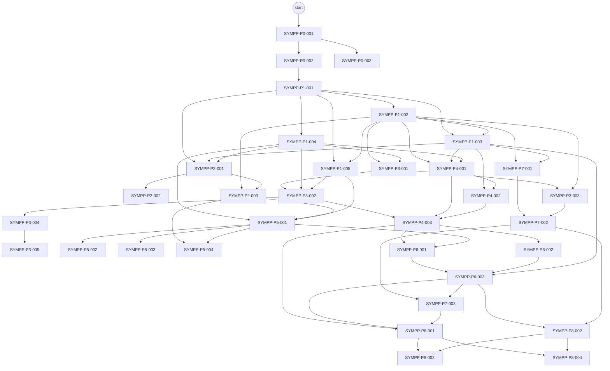

# Work Package Dependency Graph

```mermaid
graph TD
  START((start))
  START --> SYMPP_P0_001[SYMPP-P0-001]
  SYMPP_P0_001 --> SYMPP_P0_002[SYMPP-P0-002]
  SYMPP_P0_001 --> SYMPP_P0_003[SYMPP-P0-003]
  SYMPP_P0_002 --> SYMPP_P1_001[SYMPP-P1-001]
  SYMPP_P1_001 --> SYMPP_P1_002[SYMPP-P1-002]
  SYMPP_P1_001 --> SYMPP_P1_003[SYMPP-P1-003]
  SYMPP_P1_002 --> SYMPP_P1_003[SYMPP-P1-003]
  SYMPP_P1_001 --> SYMPP_P1_004[SYMPP-P1-004]
  SYMPP_P1_001 --> SYMPP_P1_005[SYMPP-P1-005]
  SYMPP_P1_002 --> SYMPP_P1_005[SYMPP-P1-005]
  SYMPP_P1_001 --> SYMPP_P2_001[SYMPP-P2-001]
  SYMPP_P1_003 --> SYMPP_P2_001[SYMPP-P2-001]
  SYMPP_P1_004 --> SYMPP_P2_001[SYMPP-P2-001]
  SYMPP_P2_001 --> SYMPP_P2_002[SYMPP-P2-002]
  SYMPP_P1_002 --> SYMPP_P2_003[SYMPP-P2-003]
  SYMPP_P2_001 --> SYMPP_P2_003[SYMPP-P2-003]
  SYMPP_P1_002 --> SYMPP_P3_001[SYMPP-P3-001]
  SYMPP_P1_004 --> SYMPP_P3_001[SYMPP-P3-001]
  SYMPP_P3_001 --> SYMPP_P3_002[SYMPP-P3-002]
  SYMPP_P1_004 --> SYMPP_P3_002[SYMPP-P3-002]
  SYMPP_P1_005 --> SYMPP_P3_002[SYMPP-P3-002]
  SYMPP_P3_001 --> SYMPP_P3_003[SYMPP-P3-003]
  SYMPP_P1_002 --> SYMPP_P3_003[SYMPP-P3-003]
  SYMPP_P3_002 --> SYMPP_P3_004[SYMPP-P3-004]
  SYMPP_P3_004 --> SYMPP_P3_005[SYMPP-P3-005]
  SYMPP_P1_002 --> SYMPP_P4_001[SYMPP-P4-001]
  SYMPP_P1_003 --> SYMPP_P4_001[SYMPP-P4-001]
  SYMPP_P1_004 --> SYMPP_P4_001[SYMPP-P4-001]
  SYMPP_P1_003 --> SYMPP_P4_002[SYMPP-P4-002]
  SYMPP_P4_001 --> SYMPP_P4_002[SYMPP-P4-002]
  SYMPP_P3_002 --> SYMPP_P4_003[SYMPP-P4-003]
  SYMPP_P4_001 --> SYMPP_P4_003[SYMPP-P4-003]
  SYMPP_P4_002 --> SYMPP_P4_003[SYMPP-P4-003]
  SYMPP_P1_004 --> SYMPP_P5_001[SYMPP-P5-001]
  SYMPP_P1_005 --> SYMPP_P5_001[SYMPP-P5-001]
  SYMPP_P2_003 --> SYMPP_P5_001[SYMPP-P5-001]
  SYMPP_P5_001 --> SYMPP_P5_002[SYMPP-P5-002]
  SYMPP_P5_001 --> SYMPP_P5_003[SYMPP-P5-003]
  SYMPP_P2_003 --> SYMPP_P5_004[SYMPP-P5-004]
  SYMPP_P5_001 --> SYMPP_P5_004[SYMPP-P5-004]
  SYMPP_P4_003 --> SYMPP_P6_001[SYMPP-P6-001]
  SYMPP_P5_001 --> SYMPP_P6_001[SYMPP-P6-001]
  SYMPP_P4_003 --> SYMPP_P6_002[SYMPP-P6-002]
  SYMPP_P6_001 --> SYMPP_P6_003[SYMPP-P6-003]
  SYMPP_P6_002 --> SYMPP_P6_003[SYMPP-P6-003]
  SYMPP_P1_003 --> SYMPP_P6_003[SYMPP-P6-003]
  SYMPP_P1_002 --> SYMPP_P7_001[SYMPP-P7-001]
  SYMPP_P1_003 --> SYMPP_P7_001[SYMPP-P7-001]
  SYMPP_P7_001 --> SYMPP_P7_002[SYMPP-P7-002]
  SYMPP_P3_003 --> SYMPP_P7_002[SYMPP-P7-002]
  SYMPP_P7_002 --> SYMPP_P7_003[SYMPP-P7-003]
  SYMPP_P6_003 --> SYMPP_P7_003[SYMPP-P7-003]
  SYMPP_P4_003 --> SYMPP_P8_001[SYMPP-P8-001]
  SYMPP_P6_003 --> SYMPP_P8_001[SYMPP-P8-001]
  SYMPP_P7_003 --> SYMPP_P8_001[SYMPP-P8-001]
  SYMPP_P6_003 --> SYMPP_P8_002[SYMPP-P8-002]
  SYMPP_P7_002 --> SYMPP_P8_002[SYMPP-P8-002]
  SYMPP_P8_001 --> SYMPP_P8_003[SYMPP-P8-003]
  SYMPP_P8_002 --> SYMPP_P8_003[SYMPP-P8-003]
  SYMPP_P8_001 --> SYMPP_P8_004[SYMPP-P8-004]
  SYMPP_P8_002 --> SYMPP_P8_004[SYMPP-P8-004]
```
